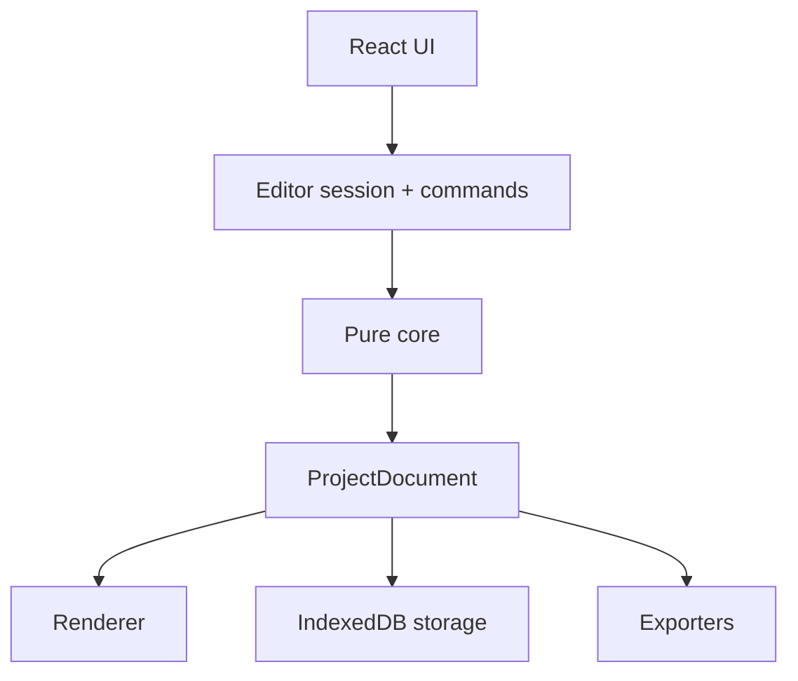

# Architecture

## Invariants

1. `ProjectDocument` is the only source of truth for project content.
2. UI state never enters the document schema.
3. Core is pure TypeScript and has no framework or browser dependency.
4. Domain operations are immutable and have one canonical implementation.
5. Editor, preview, SVG, PNG, and PDF follow the same document rendering rules.
6. Assets are Blob records; documents contain stable IDs only.

## Dependency direction



`src/core` is the innermost boundary. `brand` depends on core. `renderer` depends on core and the font registry. `storage` depends on core migrations and validation. `export` composes renderer, fonts, and asset reads. Only `editor` knows about React and Zustand.

## Document and UI state

Document state contains slides, layers, geometry, text, styles, fonts, brand settings, and content planning. It is held by `DocumentSession`, exposed through `useSyncExternalStore`, and changed only by commands.

Zustand contains transient UI state: active slide, selection, zoom, panel, tool, hover, focus mode, safe-area visibility, and snapping guides. Saving a project never serializes this store.

## Transactions and history

`DocumentTransactionHistory` stores before/after values only for committed domain actions. Pointer interactions follow:

```text
pointerdown → begin transaction
pointermove → transient immutable documents
pointerup   → one history entry
```

Transient pointer coordinates live in refs. The revision number represents persisted storage state and is normalized when undo/redo restores older content.

## Storage

Dexie owns three tables:

| Table | Purpose |
|---|---|
| `projects` | Validated, versioned `ProjectDocument` JSON |
| `assets` | Blob, MIME type, name, byte size, project ID |
| `recoveries` | Bounded snapshots from the previous persisted revision |
| `brandKits` | Reusable custom local Brand Kits |
| `metadata` | One-time migration markers and local repository metadata |

`saveProject(document, expectedRevision)` executes an atomic compare-and-save transaction. A stale writer receives `RevisionConflictError`. Zod validates every stored current document and migrations upgrade older schemas before use.

On first V2 launch, a one-time adapter reads the V1 localStorage keys, migrates valid projects and custom Brand Kits, extracts Base64 images into Blob records, and leaves the original values untouched as a fallback.

## Rendering and export

The DOM renderer and SVG serializer consume the same layer types, frame presets, font registry, colors, opacity, rotation, direction, and alignment. Selection outlines, safe areas, resize handles, and snap guides live in the editor overlay and never reach exporters.

SVG uses native shapes and `text/tspan`, including RTL direction and deterministic wrapping. Fonts and image blobs are embedded as data URLs for portable output. PNG rasterizes that canonical SVG. PDF lazily loads `pdf-lib`, rasterizes each slide from SVG, and writes fixed-size pages.

React-Konva was deliberately not adopted: the fixed-frame DOM/SVG renderer preserves accessible text, makes RTL editing straightforward, and avoids maintaining a second drawing model. It can be reconsidered only if profiling demonstrates a concrete bottleneck that DOM/SVG cannot solve.

## Performance boundaries

- Each layer and slide renderer is memoized by immutable reference.
- Editing one slide does not rerender the other slide renderers.
- Pointer transactions update only the document subscribers that need the live canvas.
- Heavy editor code is dynamically loaded after the dashboard.
- Exporters and `pdf-lib` load only when the user requests a format.
- Editor fonts load on demand from the central registry.
- Zustand consumers use narrow selectors.
